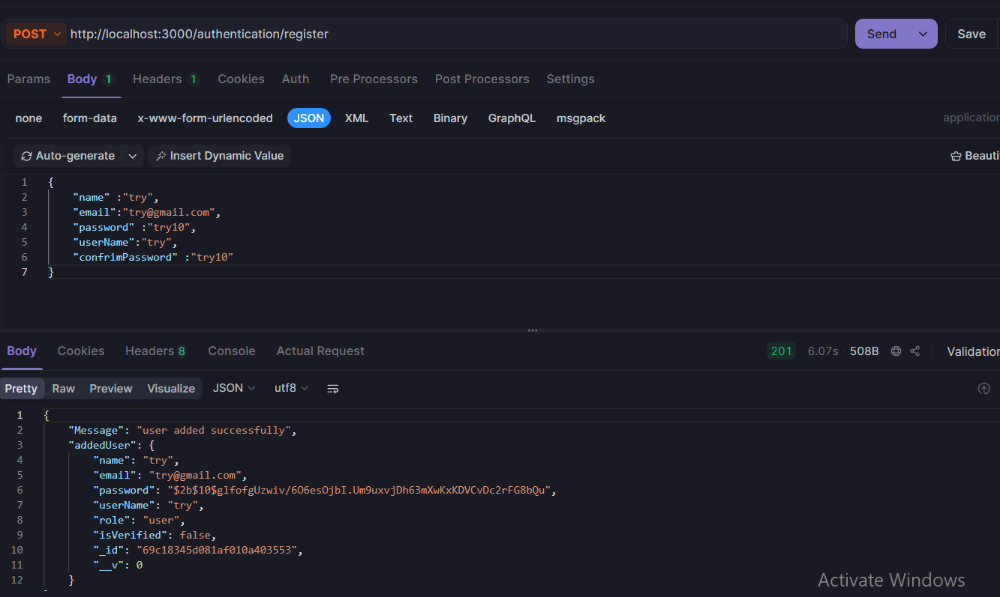
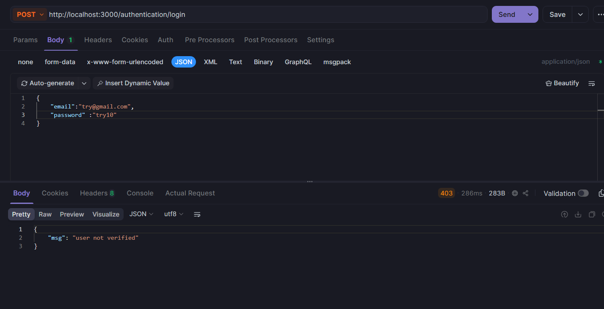
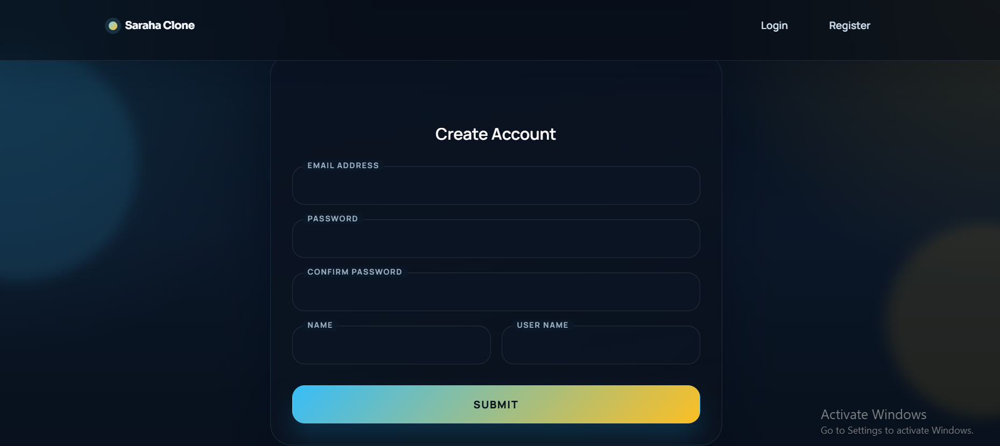
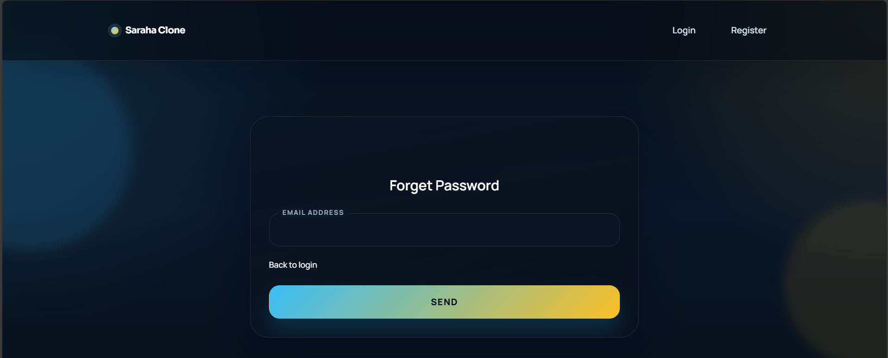
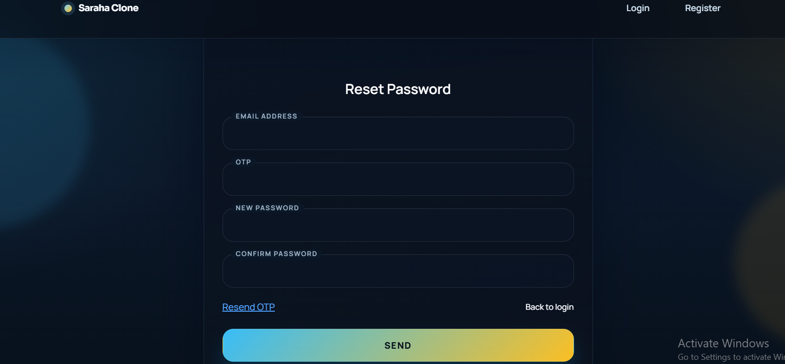
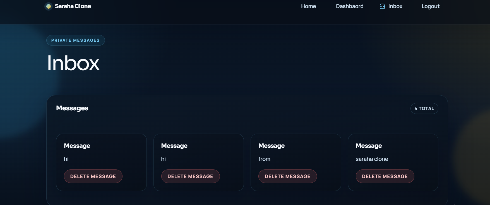
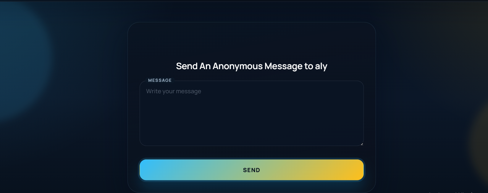

# Saraha Clone — Full Stack Application

A full-stack anonymous messaging platform inspired by Saraha.

This project combines a **React + Vite frontend** with a **Node.js + Express backend** to deliver a complete user experience including authentication, password recovery, inbox management, and public anonymous messaging.

---

## Live Demo

- Frontend: `https://saraha-clone-frontend.vercel.app`

---

## Tech Stack

### Backend
- Node.js
- Express.js
- MongoDB
- Mongoose
- JWT Authentication
- Nodemailer

### Frontend
- React 19
- Vite
- React Router DOM
- Axios
- React Hook Form
- Zod
- Tailwind CSS v4
- Flowbite

---

---

## 📸 Screenshots

### 🔐 test Register api

### 🔐 test Login api

### 🔐 Register

### 🔑 Login

### 🏠 Dashboard

### 📥 Inbox

### 🌍 Public Profile (Anonymous Message)

## Features

### Authentication
- User registration and login
- JWT-based authentication
- Protected routes
- Forgot password & reset password using OTP via email

### Dashboard
- Fetch authenticated user profile
- Generate and display public profile link
- Copy shareable profile URL

### Inbox
- Receive anonymous messages
- Display messages in a card-based UI
- Delete messages

### Public Profile
- Dynamic routing using `userName`
- Send anonymous messages without login
- Backend resolves username to user ID
